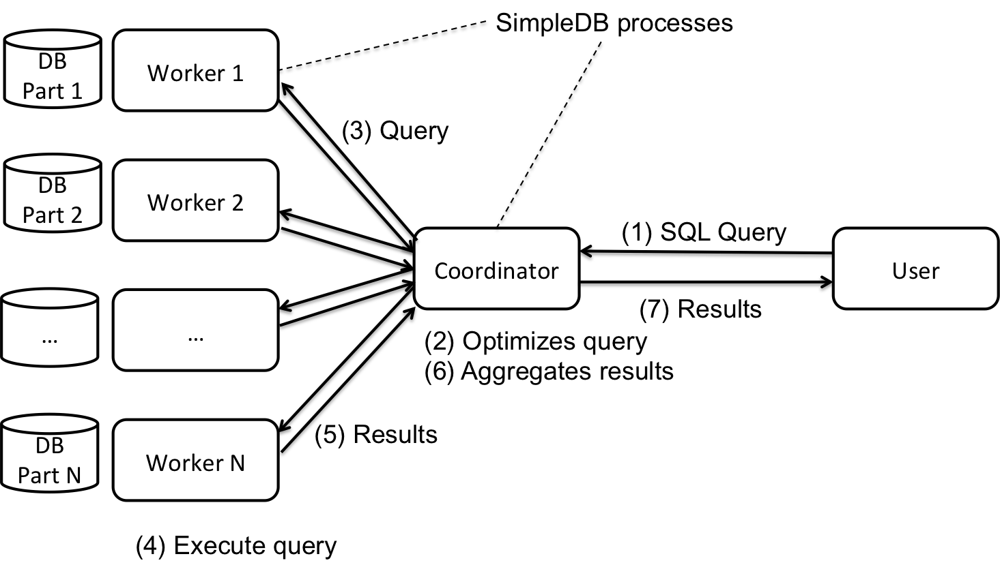
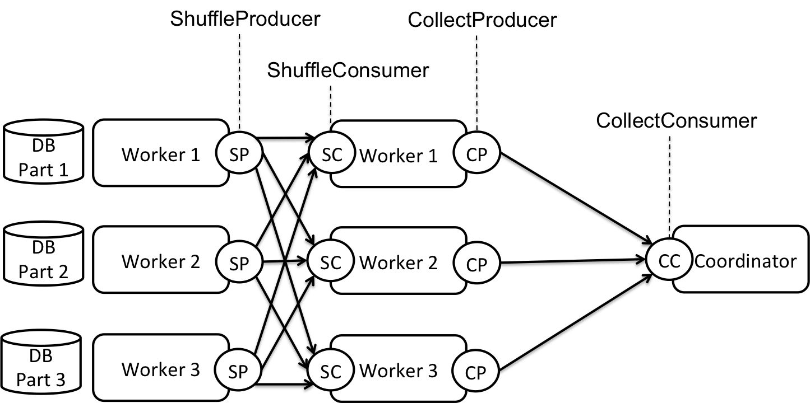

# CSE444 Lab 6: Parallel Processing

**Milestone Due: Wednesday, June 1, 2016**
**Final Due: Wednesday, June 8, 2016**

In this lab, you will extend SimpleDB to run in parallel using multiple processes. These processes may all be on a single machine or may be spread across multiple physical machines! If you have access to multiple machines, you may find it fun to test the latter. Otherwise, you can complete the whole assignment on a single machine by running multiple processes on it.

A parallel database management system that runs in a cluster of independent servers is said to follow a shared-nothing architecture.

The main tasks of the lab include:

*   Implementing parts of a basic worker process for parallel query processing. In a shared-nothing database management system, multiple workers execute in parallel while exchanging data with each other to compute a query's output.
*   Implementing a special operator called shuffle to enable SimpleDB to run joins in parallel.
*   Implementing an optimized parallel aggregation operator.

These three tasks will expose you to three core aspects of parallel data processing: (1) executing queries using more than one process, (2) exchanging data between processes for efficient parallel processing, and (3) optimizing operators for a parallel architecture.

As usual, you are free to choose your own design to implement the various components, but we provide guidelines along the way.

The remainder of this document describes what is involved in building a parallel version of SimpleDB and provides a basic outline of how you might add this functionality to SimpleDB.

As with the previous labs, we recommend that you start as early as possible!

## 1\. Getting started

You should begin with the code you submitted for either **Lab 4** or **Lab 2**. (If you did not submit code for Lab 2, or your solution didn't work properly, contact us to discuss options).

We have provided you with extra test cases as well as source code files for this lab that are not in the original code distribution you received. We reiterate that the unit tests we provide are to help guide your implementation along, but they are not intended to be comprehensive or to establish correctness. You will need to add these new test cases and new code to your release. The easiest way to do this is to pull from upstream as follows:

```sh
$ git pull upstream lab6
```

### Implementation hints

We suggest exercises along this document to guide your implementation, but you may find that a different order makes more sense for you. As before, we will grade your assignment by looking at your code and verifying that you have passed the test for the ant targets `test` and `systemtest`. See Section 3.4 for a complete discussion of grading and the tests you will need to pass.

Here's a rough outline of one way you might proceed with this lab. More details on these steps are given in Section 2 below.

*   Implement the methods associated with the worker: `parallel/Worker.java`
*   Implement the methods associated with the shuffle operator: `parallel/ShuffleProducer.java` and `parallel/ShuffleConsumer.java`
*   Implement the optimized parallel aggregation operator. `parallel/AggregateOptimizer.java`

## 2\. Parallel SimpleDB outline

SimpleDB follows a standard architecture for a parallel database management system as illustrated in Figure 1.



Figure 1: Overview of parallel SimpleDB

When executing a single instance of SimpleDB, as we did in the previous assignments, we run a single SimpleDB process (i.e., a Java application), which receives commands from the user in the form of SQL queries; parses, optimizes, and executes these queries; and then returns results to the user. In the parallel deployment, we execute multiple instances of SimpleDB, each in its own process (i.e., separate java applications). One process performs the special role of the _coordinator_, while all other processes are _workers_. Each relation in the database is partitioned _horizontally_ and each worker sees only one fragment of each relation.

Note:

*   The SimpleDB coordinator application entry point is in `parallel/Server.java`
*   The SimpleDB worker application entry point is in `parallel/Worker.java`

The major difference between single-node SimpleDB and parallel SimpleDB is that each query execution is now completed by a set of concurrently executing processes that can only communicate over the network or through inter-process communication techniques (if all processes run on a single machine). SimpleDB accomplishes data transfers, such as when joining two tables, using four operators dedicated to data sharing. They are described below and illustrated in Figure 2.

*   `ShuffleProducer` and `ShuffleConsumer`: SimpleDB uses `ShuffleProducer` to distribute tuples to the workers according to some partition function (provided as a `PartitionFunction` object during the `ShuffleProducer`'s instantiation). An example of a `PartitionFunction` is as follows: given two workers, send all the tuples with the first attribute's value less than 100 to the first worker, and send the remaining tuples to the other worker. SimpleDB uses `ShuffleConsumer` to collect the tuples received at a worker from multiple source workers' `ShuffleProducer` operators.
*   The `Collect` operator transmits tuples from all the workers to a pre-selected worker or to the coordinator.



Figure 2: Parallel query plans with data shuffling.

The two data sharing operators require inter-process communication (IPC). We use TCP connections to implement this. More specifically, we use the Apache Mina framework. More information on java socket programming can be found here: [http://docs.oracle.com/javase/tutorial/networking/sockets/index.html](http://docs.oracle.com/javase/tutorial/networking/sockets/index.html). More information about Mina can be found here: [http://mina.apache.org/documentation.html](http://mina.apache.org/documentation.html).

An IPC action is acomplished by a sender process sending some data to a receiver process. In SimpleDB, all senders are instances of type `Producer`, and all receivers are instances of type `Consumer`. Thus, both data transfer operations, that is, _shuffling_ and _collecting_, are implemented using a `Producer`-`Consumer` pair, where the `Producer` and the `Consumer` reside at different workers. In other words, `CollectProducer` and `CollectConsumer` together perform the function of _collecting_ tuples, and `ShuffleProducer` and `ShuffleConsumer` together perform the function of _shuffling_ tuples.

SimpleDB performs the following sequence of actions to execute a query in parallel:

1.  The coordinator handles all interactions with the user. As in the previous labs, the user submits a query either as a command-line input or as a command-line argument specified using the `-f` option during system startup. The latter is useful for testing.
2.  The coordinator translates the SQL query to a sequential execution plan that can be executed on a stand-alone (not parallel) SimpleDB instance.
3.  Then, the coordinator inserts the data sharing operators into the sequential plan. A (`ShuffleProducer`, `ShuffleConsumer`) pair is inserted between relational operators that require data shuffling such as between a join operator and each of its children. A (`CollectProducer`, `CollectConsumer`) pair is inserted when data needs to be collected at a single worker, for example, just before an aggregate operator. This produces a parallel query plan that the parallel SimpleDB can execute.
4.  Although we have a functional parallel query plan at this point, it might not be efficient. Unlike a single-site DBMS, inter-process data transfers in a parallel DBMS are expensive. Thus, a good parallel query execution plan should try to minimize the amount of data exchanged between the processes. During query optimization, each parallel query plan goes through a chain of optimizers, where each optimizer improves a distinct aspect of its input query plan. SimpleDB's optimizer chain is implemented by the `ParallelQueryPlanOptimizer` class that uses the following set of optimizers: `ProjectOptimizer`, `FilterOptimizer`, `BloomFilterOptimizer`, and `AggregateOptimizer`. By default SimpleDB uses all implemented optimizers: `ProjectOptimizer`, `FilterOptimizer`, `BloomFilterOptimizer`, and `AggregateOptimizer`. You can switch optimizers on/off in the `processQuery` method in `Server.java`. For example, to switch off the `ProjectOptimizer`, just comment out the line:

    ```java
    p = ParallelQueryPlan.optimize(tid, p, new ProjectOptimizer());
    ```

    Among the optimizers, you are only required to implement some parts of `AggregateOptimizer`. All the other optimizers are already implemented for you.

5.  After optimizing the plan, the coordinator dispatches the optimized query plan to the workers. The workers execute the query plans on their locally available datasets and return the final query output to the coordinator.
6.  Finally, the coordinator outputs the results back to the user.

As part of this lab, you will implement three components of the parallel SimpleDB system: pieces of the worker process, the `Shuffle` operator, and the `AggregateOptimizer`.

### 2.1 Starting a Parallel SimpleDB Deployment

**IMPORTANT: The master and the workers need to run the same version of java.**

We provide a script to deploy SimpleDB in parallel either on a single machine or on separate physical machines.You can find the Bash script under `src/bin/startSimpleDB.sh`. The script is designed for use on Linux, Mac OS and Windows/CYGWIN.

This script performs the following actions in order:

1.  Splits all relations in the database horizontally. The number of data partitions equals the number of workers. Each worker will get one data partition.
2.  Copies each database fragment to the physical machine where the corresponding worker will execute.
3.  Starts worker processes on their physical machines.
4.  Starts the coordinator process on its physical machine.

You can configure the IP and port number for the coordinator and the worker processes by editing the files `conf/server.conf` and `conf/workers.conf`. To add more workers, simply add more lines with new port numbers in the file `conf/workers.conf`.

The script uses ssh and rsync in the first data copying step. You are required to install a SSH server on each worker machine.

*   On Linux, you can install OpenSSH either through package managers such as apt in Ubuntu/Debian and yum in Fedora Core/Red Hat, or you can download the source code and compile it by yourself.
*   On Mac, a ssh server is by default already installed but not enabled. To enable it, go to 'System Preferences'-> 'Internet & Networking' -> 'Sharing' or you may need to go directly to 'System Preferences' -> 'Sharing' . Check the 'Remote Login' option in the list.
*   On CYGWIN, make sure that you've selected to install ssh at the time you installed CYGWIN. And then [follow these instructions](http://www.noah.org/ssh/cygwin-sshd.html).

SSH uses two user authentication mechanisms: a username/password pair and public-key authentication. To run the script, public-key authentication is required. The configuration steps for all the three platforms are generally the same.

If you are going to run all processes on the same machine, the simplest configuration that you can try looks as follows:

```sh
cd ~/.ssh
# When you execute the following, type ENTER to accept all the default options.
# You don't have to enter a passphrase
ssh-keygen -t rsa
cat id_rsa.pub > .ssh/authorized_keys
```

If you are going to use multiple machines, the last step requires that you copy the local public key (`id_rsa.pub`) and add it to the `.ssh/authorized_keys` file on the _remote_ machines.

If these simple instructions fail, you read through [more detailed instructions](https://hkn.eecs.berkeley.edu/~dhsu/ssh_public_key_howto.html).  Getting public-key authorization working under SSH can be tricky, but there are many resources to help you move forward.

Once you have your keys configured, to start your parallel SimpleDB deployment, you should execute this script as follows:

```sh
# Step 1: Build SimpleDB either through eclipse or by running "ant dist" on the command line
# IMPORTANT: Notice that the build will copy startSimpleDB.sh from ./src/bin/ to ./bin/.
# Make sure to call the script under ./bin/ as indicated in step 2!
$ ant dist

# Step 2: Make the script executable:
$ chmod u+x bin/startSimpleDB.sh

# Step 3: Run the script located in the *****top-level bin directory*****:
# Step 3.1: We provide a small imdb database under directory etc/
# First, you need to extract the data from the tar file:
$ cd etc
$ tar zxvf sample-0.1.tar.bz2
# Or try tar -vxjf to unzip the file
$ cd ..

# Step 3.2: Now you can run the script. The general format is
# ./bin/startSimpleDB.sh catalogFile [-explain] [-f queryFile]

# To run it on the imdb database that we provide, execute:
$ ./bin/startSimpleDB.sh etc/imdb.schema


# The output at the coordinator should look as follows
Start splitting data files to worker partitions
... more messages here...
Computing table stats.
Done.
SimpleDB>

# For each worker, a new terminal window should appear with some messages including:
# (Note: this relies on xterm, which may not be available under all configurations)
 ... some messages here...
Worker started at port:24448

# Step 4: You can now execute queries by entering SQL statements at the coordinator.
# While the query will appear to execute, it will actually hang the whole system. That's because
# the implementation is not complete
SimpleDB> select * from Actor;

# Step 5: To quit the system, simply run "quit" on the coordinator
# The workers will automatically terminate after the coordinator terminates
# Because the implementation is incomplete, you need to quit using Ctrl-C
SimpleDB> quit;
# or
SimpleDB> exit;
# (or Ctrl-C)
```

### Debugging hints

Debugging distributed systems can be challenging. You may find the following information useful:

*   Remember the following command to see what SimpleDB processes are running (Linux or Mac): `ps aux | grep java` (Windows): Use the "process" tab on the task manager
*   If a process crashes while using a port number, that port number may remain unavailable for some time.
*   Remember that some port numbers are reserved by the system. Typically, these are the port numbers with low values (less than 1024). Do not use these port numbers. And also note that the maximum valid port number is 65535.
*   One way to debug a distributed system is to log debug messages to files and then examine the content of the files.
*   Debugging parallel systems in Eclipse is not as easy as debuging single-process programs, but it is still possible. One way to do this is to first start the coordinator (`Server.java`) in debug mode in Eclipse and then start the workers one by one in debug mode in Eclipse. Eclipse is able to concurrently debug multiple running programs. Note that each worker tries to load its data files by reading `[CURRENT_WORKING_DIRECTORY]/data/[PORT_NUMBER]/catalog.schema` and read the configuration files under `[CURRENT_WORKING_DIRECTORY]/conf`. Make sure that the `data/conf` files are present. Another thing to pay attention to is that the console of Eclipse will change display every time a debugging program writes some output. You can manually select the right console from the list by clicking the button on the right top of the console view.

### 2.2 Worker Process and Parallel Selection Queries

In the first part of the assignment, we will execute a parallel selection query over the IMDB database. In this assignment, we will use the [10% version of IMDB](etc/sample-0.1.tar.bz2) ([schema](etc/imdb.schema)).

When executing a selection query in parallel, worker nodes need not talk to each other. Each worker will execute the selection locally and will send the results to the coordinator using the `Collect` operator as illustrated in Figure 1.

We provided you with the code for the coordinator (see `simpledb.parallel.Server`) but you need to complete the implementation of the workers in `simpledb.parallel.Worker`.

Note that before you implement the actual query execution on workers, for each query, the workers always return an empty result set to the server.

The majority of the Worker class is already provided. You only need to implement two methods: `localizeQueryPlan` and `executeQuery`.

After a query plan is received from the coordinator, a worker needs to replace some database information in the query plan with local versions of the same information. Three changes need to be made to the query plan inside the `localizeQueryPlan` method. In this method, your receive as input a query plan in the form of a tree of operators. You need to traverse that tree of operators from the root to the leaves. For each operator, you need to check whether it is a sequential scan, a producer, or a consumer operator. For these operators, you need to make the following changes:

*   Update each sequential scan operator in the query plan to use the appropriate local file. For example, in the IMDB dataset, logically the Actor table across all the workers refers to the same table, but physically each worker has its partition of the Actor table in a different file. The localizeQueryPlan method should update the mapping between the name "Actor" and the real table file it refers to in the query plan. To make this change, you should simply use the database catalog at the worker.
*   For each producer type of operator, you need to update the worker where the producer is running. Set it to `Worker.this`. The reason is that the producer operator will need to ask the local worker how to connect to the consumer processes where it needs to send data. See implementation of `CollectProducer` for more details.
*   For each consumer type of operator, you need to associate an input buffer with that operator. The reason is that the system will accumulate all incoming tuples into a set of buffers. We need to then link each buffer to the appropriate consumer operator. (_Hint_: check the declaration of the data structure `inBuffer` in class `Worker`. Use the operator ID to find the right buffer in this data structure.)

The `executeQuery` method does the real query execution. This method uses a separate thread to execute the query. Complete the implementation of `WorkingThread.run` by adding code to execute the query. (_Hint_: The root of a query plan is always a `CollectProducer`.)

#### Exercise 1

Complete the implementation of the Worker class.

You should now be able to pass the WorkerTest **Important**: To pass this test, you also need to implement the constructor of `ShuffleProducer` and `ShuffleConsumer` as well as their `setChildren` and `getChildren` methods.

Execute the following parallel selection query on the 10% sample of the IMDB database.

```sql
select * from Actor where id < 1000;
```

Please report the execution time when using 1, 2, and 4 workers.

To change the number of worker processes, you need to edit the file `conf/workers.conf`. Notice that the runtime will be different the first time you execute a query (cold cache) vs the subsequent times that you execute the same query (warm cache). Feel free to report either number or both. Comment on the SimpleDB performance. Do you see a linear speed-up or something else? Feel free to try other queries and other numbers of workers. Do not worry about having good or bad performance. Simply tell us what you see and reflect on what you see in your final report.

### 2.2\. Shuffle Operator and Parallel Join Queries

In order to execute join queries in parallel, workers need the ability to exchange data using a `Shuffle` operator as illustrated in Figure 2\.

In this assignment, we will only implement parallel equijoins. To execute an equijoin in parallel, SimpleDB must ensure that tuples from the two relations that we want to join are sent to the same worker. For example, if we want to join `Actor` and `Casts` using the predicate `Actor.id = Casts.pid`, we must ensure that tuples from `Actor` and tuples from `Casts` that share the same value of an actor ID are sent to the same worker. The shuffle operator performs this data re-partitioning.

The shuffle operator has two components: a `ShuffleProducer` and a `ShuffleConsumer`.

The `ShuffleProducer` pulls data from the operator below it in the query plan. It applies a hash function to the value of the join attribute of each input tuple. The computed hash value determines the worker where the tuple should be routed. The ShuffleProducer maintains one output queue and one TCP connection for each worker.

The `ShuffleConsumer` unions all the tuples received from upstream `ShuffleProducers` and makes them available to the join operator using the standard `Iterator` interface.

#### Exercise 2

Complete the implementation of the `ShuffleProducer` and `ShuffleConsumer` classes.  (_Hint_: Look at the code for the `CollectProducer` and `CollectConsumer` operators!)

You should now be able to pass the `ShuffleTest`.  When you run this test, you will see an `InterruptedException`, which is expected.

Execute the following parallel query on the 10% sample of the IMDB database.

```sql
select m.name,m.year,g.genre
  from Movie m,Director d,Genre g,Movie_Director md
  where d.fname='Steven' and d.lname='Spielberg'
    and d.id=md.did and md.mid=m.id
    and g.mid=m.id;
```

Please report the execution time when using 1, 2, and 4 workers. To change the number of worker processes, you need to edit the file `conf/workers.conf`. Do not worry about having good or bad performance. Simply tell us what you see and reflect on what you see in your lab write-up.

### 2.3\. Optimizing Parallel Aggregation Operator

The computation of aggregates has two different cases:

*   Aggregate without a group-by. The basic approach to executing an aggregate in parallel is to collect all the tuples that the aggregate operator will consume as input from all the workers and then perform the aggregation on a single worker. For example, to execute `count(*)` on table Actor, all workers must scan the tuples in their local partitions of the Actor table and send these tuples to a single worker, which will count the total number of tuples.
*   Aggregate with a group-by. The basic approach to computing an aggregate in parallel in this case is similar to join: we can hash-partition the data on the groupby attribute and compute the aggregate value for different groups using different workers.

These basic implementations leave significant room for improvement. For example, when executing `count(*)` on Actor, each worker can compute the local count and then send this partial count to the collector worker. The same mechanism can be applied in aggregates with group by. For example, if we want to compute the count of all actors that appeared in each movie, we can scan the `Casts` relation in parallel on all the workers. Each worker can group the local data on the movie ID (`mid`) and can count the total number of actors for each movie locally. It can then re-shuffle the resulting partial aggregates such that all partial results for the same movie land on the same worker, which will perform the final aggregate computation by summing up the intermediate counts.

The above optimization works for all _algebraic_ aggregates including min, max, count, and average (note that for average, the partial aggregate takes the form of a sum and count). It does not work for _holistic_ aggregates such as median.

In this last exercise, we ask you to implement this optimization for the following standard algebraic aggregates: min, count, sum and average. The implementation for max is already provided as example. Note that, for avg, what you are required to implement is not the optimization code, but the SC_AVG aggregate function.

If the aggregate is accompanied by a group by, every worker receives the same quey plan and then directly reports the results to the coordinator. If group by is not in the query, we need a worker to collect the partial aggregate results from all the workers (including itself) and then do the final aggregation. The coordinator will pick the collector worker (randomly in the current implementation) before the query plans get dispatched. We call the selected worker the _Master Worker_. In this case, the query plan of the master worker is different from that of the other workers. The query plan of all other workers ends with sending partial aggregate results to the master worker. While the master query plan does both the partial aggregate (on its own partition of the database), and the final aggregate of the partial aggregate results. The master worker finally sends the final aggregate result to the coordinator.

#### Exercise 3

Complete the implementation of `simpledb.parallel.AggregateOptimizer.java` and the SC_AVG operator in `Aggregate.java` and `Aggregator.java`

You should now be able to pass the `ParallelAggregateTest`.

Execute the following parallel query on the 10% sample of the IMDB database:

```sql
select m.name,count(a.id)
  from Movie m,Director d,Movie_Director md, Actor a,Casts c
  where d.fname='Steven' and d.lname='Spielberg'
    and d.id=md.did and md.mid=m.id
    and c.mid=m.id
    and c.pid=a.id
    group by m.name;
```

Please report the execution time when using 1, 2, and 4 workers. To change the number of worker processes, you need to edit the file `conf/workers.conf`. Again, do not worry about having good or bad performance. Simply tell us what you see and reflect on what you see in your lab write-up. You may find it interesting to try and run the query with or without this optimization.

### 2.3 Running on a Cluster (Optional)

With the implementation complete, you are now ready to move off of your local development system and into a real distributed environment.  To do this, perform the following steps:

1. Clone your repository on `attu` and build the database (`ant dist`)
2. Modify your configuration files to use multiple nodes:

   `server.conf`:
   ```conf
   128.208.1.138:11111 # Change to a distinct random port number > 1024!
   ```

   `worker.conf`:
   ```conf
   attu1:12345 # Change these to random port numbers > 1024!
   attu2:12345
   attu3:12345
   attu4:12345
   ```

3. Launch simpledb (`bin/startSimpleDB.sh etc/imdb.conf`)
4. Execute the queries from the previous section.  How does the performance compare?

### 2.4 Project Extensions

In this section, we describe several possible extensions to your parallel SimpleDB system. These are less well defined than the previous exercises but give you a chance to show off your mastery of parallel data processing!

**As part of the project, we ask you to pick one or more of the following extensions. Alternatively, you can also implement an extension of your choice.**

**Make sure to develop unit-tests and system tests for verifying the correctness of your extension(s).** Please use JUnit when appropriate but feel free to also go beyond JUnit and use scripts if that helps you test some interesting, additional configurations. For the tests that you add, please add them to a separate directory called **test-extensions**.

1) _Implement a Skewed Join (i.e., "subset-replicate")_. Run experiments with the hash-based equi-join on the IMDB dataset or on synthetically generated datasets. Examine the performance that you get. Do you ever observe any skew? If so, try to implement a `SkewedJoin`. Compare the performance between the two join implementations.

2) _Implement a broadcast join_ (i.e., "small join") where one relation is replicated to all workers before the join. Run experiments that show when this type of join is better then a standard hash equijoin and when this type of join is worse.

3) _Implement a fuzzy join_. In some applications, the join predicate is not strict equality but an approximate equality. For example, I may join a relation R with restaurants to a relation S with movie theaters and make the join be `zipcode_restaurant >= zipcode_movie - 1` and `zipcode_restaurant <= zipcode_movie + 1`. To run this type of join in parallel, we need to partition R and replicate S across adjacent buckets.

3) _Data partitioning experiments._ Experiment with different types of data partitioning schemes either for the input data or when re-shuffling data as part of join or aggregate operations. Experiment with range partitioning and hash partitioning. Show experimentally the properties of these two data partitioning shemes. When is each one better than the other.

4) _Performance analysis_. Experiment with the performance of Parallel SimpleDB when using multiple processes on the same machine vs multiple physical machines vs both. Experiment with the performance as you vary the size of partitions and numbers of processes and machines.

## 3\. Logistics

You must submit your code (see below) as well as the final project report as per the instructions [here](https://courses.cs.washington.edu/courses/cse444/16sp/content/Project.html).

### 3.1\. Collaboration

All CSE 444 labs are to be completed `INDIVIDUALLY`! However, you may discuss your high-level approach to solving each lab with other students in the class.

### 3.2\. Submitting your assignment

You may submit your code multiple times; we will use the latest version you submit that arrives before the deadline. Place the write-up in a file called `lab6-answers.txt` or `lab6-answers.pdf` in the top level of your repository.

**Important**: In order for your write-up to be added to the git repo, you need to explicitly add it:

```sh
$ git add lab6-answers.txt
```

You also need to explicitly add any other files you create, such as new `*.java` files.

The criteria for your lab being submitted on time is that your code must be tagged and pushed by the due date and time. This means that if one of the TAs or the instructor were to open up GitLab, they would be able to see your solutions on the GitLab web page.

**Just because your code has been committed on your local machine does not mean that it has been submitted -- it needs to be on GitLab!**

There is a bash script `turnInLab.sh` in the root level directory of your repository that commits your changes, deletes any prior tag for the current lab, tags the current commit, and pushes the branch and tag to GitLab. If you are using Linux or Mac OSX, you should be able to run the following:

```sh
$ ./turnInLab.sh lab6
```

You should see something like the following output:

```sh
$ ./turnInLab.sh lab6
[master b155ba0] Lab 6
 1 file changed, 1 insertion(+)
Deleted tag 'lab6' (was b26abd0)
To git@gitlab.com:cse444-16sp/simple-db-pirateninja.git
 - [deleted]         lab6
Counting objects: 11, done.
Delta compression using up to 4 threads.
Compressing objects: 100% (4/4), done.
Writing objects: 100% (6/6), 448 bytes | 0 bytes/s, done.
Total 6 (delta 3), reused 0 (delta 0)
To git@gitlab.com:cse444-16sp/simple-db-pirateninja.git
   ae31bce..b155ba0  master -> master
Counting objects: 1, done.
Writing objects: 100% (1/1), 152 bytes | 0 bytes/s, done.
Total 1 (delta 0), reused 0 (delta 0)
To git@gitlab.com:cse444-16sp/simple-db-pirateninja.git
 * [new tag]         lab6 -> lab6
```

### 3.3\. Submitting a bug

SimpleDB is a relatively complex piece of code. It is very possible you are going to find bugs, inconsistencies, and bad, outdated, or incorrect documentation, etc.

We ask you, therefore, to do this lab with an adventurous mindset. Don't get mad if something is not clear, or even wrong; rather, try to figure it out yourself or send us a friendly email. Please create (friendly!) issues reports on the repository website. When you do, please try to include:

*   A description of the bug.
*   A `.java` file we can drop in the `test/simpledb` directory, compile, and run.
*   A `.txt` file with the data that reproduces the bug. We should be able to convert it to a `.dat` file using `HeapFileEncoder`.

You can also post on the class message board if you feel you have run into a bug.

### 3.4 Grading

See the final project instructions [here](https://courses.cs.washington.edu/courses/cse444/16sp/content/Project.html).

**Important:** before testing, we will replace your `build.xml`, `HeapFileEncoder.java`, and the entire contents of the `test/` directory with our version of these files! This means you cannot change the format of `.dat` files! You should therefore be careful changing our APIs. This also means you need to test whether your code compiles with our test programs. In other words, we will untar your tarball, replace the files mentioned above, compile it, and then grade it. It will look roughly like this:

```sh
$ git clone git@gitlab.com:cse444-16sp/simple-db-yourname
$ # [replace build.xml and test]
$ git checkout -- build.xml test\
$ ant test
$ ant systemtest
$ # [additional tests]
```

If any of these commands fail, we'll be unhappy, and, therefore, so will your grade.

For the tests that you add, please add them to a separate directory called **test-extensions**.

We've had a lot of fun designing this assignment, and we hope you enjoy hacking on it!

Last modified: Thu May 18 16:22:36 PDT 2016
